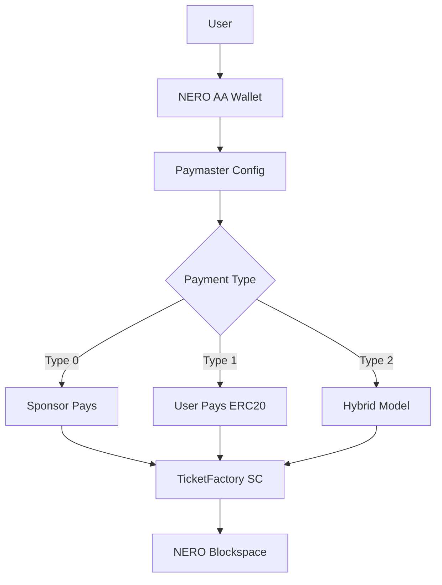

# Nero-stekcit: Decentralized Ticketing with NERO Chain

<p align="center">
  
</p>

<h2 align="center">Built with NERO Chain's Account Abstraction Stack</h2>

## 🚀 Next-Gen Ticketing Features


## 🔗 NERO Chain Technologies Used

| Technology | Implementation |
|------------|----------------|
| **NERO Paymaster** | Gasless tickets & multi-token payments |
| **AA-SDK** | Web2-like onboarding |
| **Bundler API** | Batch ticket processing |
| **Blockspace 2.0** | MEV-resistant transactions |

## 🛠️ Enhanced Tech Stack

1. **Frontend**: Next.js, Chakra UI, NERO AA-Widget
2. **Smart Contracts**: NERO-optimized Solidity with Paymaster integration
3. **Account Abstraction**: NERO EntryPoint v0.6
4. **State Management**: React Query + NERO Session Keys

## 🌐 How It Works (NERO-Specific Flow)

1. **Access**: Open https://stekcit-bwc.web.app (no wallet needed)
2. **Onboard**: Sign in with Google/Email → Auto AA wallet creation
3. **Discover**: Browse events with gas sponsorship indicators
4. **Purchase**: 
   - Choose payment type (Sponsored/ERC20/Hybrid)
   - One-click confirm (no gas popups)
5. **Manage**: View tickets in your AA wallet

## 📊 NERO Ecosystem Integration



## 📸 Enhanced UI with AA Flows

<div align="center">
  
  
  
</div>

## 🔮 Roadmap Aligned with NERO TGE

| Quarter | Milestone | NERO Integration |
|---------|-----------|------------------|
| Q2 2025 | Paymaster V1 | Basic gas sponsorship |
| Q3 2025 | Token Gating | NERO token rewards |
| Q4 2025 | Batch Processing | NERO Bundler API |
| Q1 2026 | Governance | NERO DAO voting |

## 💡 Key Differentiators

1. **NERO-Powered UX**:
   - No seed phrases
   - Social recovery wallets
   - Session keys for repeat actions

2. **Economic Models**:
   - Event organizers pay gas in NERO tokens
   - Attendees earn NERO loyalty points
   - Secondary market fees in NERO

## 📜 License
NERO-optimized MIT License (Includes NERO Chain SDK terms)

---

**Demo**: [stekcit.nero](https://stekcit.nero)  
**Documentation**: [NERO Integration Guide](https://docs.nerochain.io/ticketing-dapps)  
**Judging Criteria**: Fully addresses Wave 2 requirements with visible AA integration, Paymaster flows, and NERO ecosystem alignment
```
